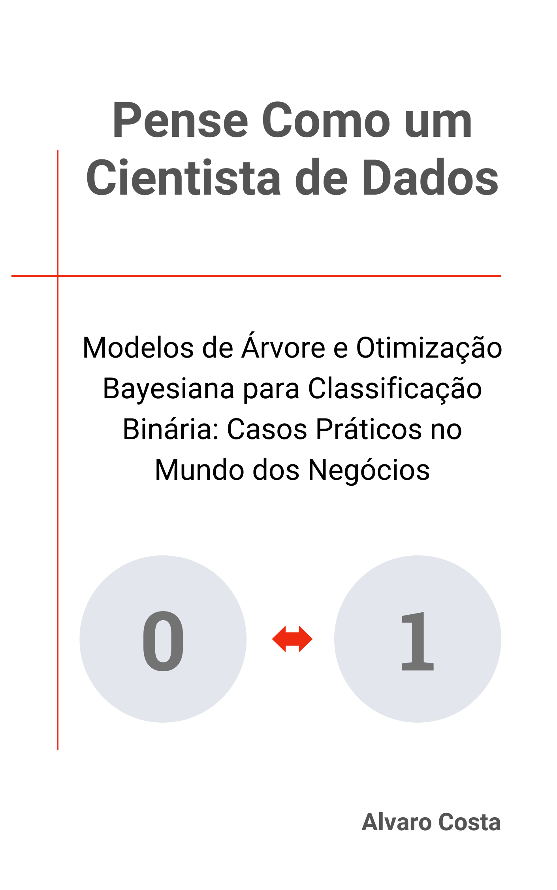

# Pense Como um Cientista de Dados

Este repositório contém os notebooks e exemplos práticos do livro **"Pense Como um Cientista de Dados: Modelos de Árvore e Otimização Bayesiana para Classificação Binária: Casos Práticos no Mundo dos Negócios"**, que aborda técnicas de **machine learning** aplicadas ao mundo dos negócios.

## Visão Geral

O livro explora como os modelos de árvore de decisão e a otimização bayesiana podem ser utilizados para resolver problemas de classificação binária, especialmente em cenários de negócios, como detecção de fraudes, *churn* e doenças cardíacas. O foco está na aplicação prática, com exemplos que podem ser reproduzidos e adaptados.

## Base Acadêmica

Este livro foi amplamente inspirado pelo trabalho acadêmico de **Ibomoiye Domor Mienye** e **Nobert Jere** no *paper* <a href="https://doi.org/10.3390/info15070394" target="_blank">"Optimized Ensemble Learning Approach with Explainable AI for Improved Heart Disease Prediction"</a>. O *paper* apresenta técnicas avançadas de otimização bayesiana aplicadas a modelos de ensemble, e muitos dos exemplos práticos no livro exploram essas abordagens no contexto de problemas reais de classificação binária em negócios.

## Exemplos de Modelos
1. **Otimização Bayesiana**
Utilizamos o algoritmo para otimização bayesiana inspirado no *paper* para ajustar os hiperparâmetros de modelos de *machine learning* como **Random Forest**, **Adaboost** e **XGBoost**, permitindo alcançar um desempenho otimizado para problemas de classificação.

2. **Interpretação de Modelos com SHAP**
A interpretação dos modelos é feita com **SHAP**, fornecendo explicações globais e locais para as previsões de modelos de *machine learning*, especialmente úteis para negócios onde a transparência é crucial.

## Contribuições
Contribuições são bem-vindas! Estamos especialmente interessados em:

- Melhorias no desempenho dos modelos
- Novos exemplos práticos de uso de otimização bayesiana
- Sugestões para novos datasets aplicados a problemas de classificação binária

Se você encontrar algum problema ou tiver sugestões de melhorias, sinta-se à vontade para abrir uma **issue** ou enviar um **pull request**.

## Licença
Este projeto está licenciado sob os termos da licença MIT. Veja o arquivo LICENSE para mais detalhes.

## Agradecimentos
Um agradecimento especial àqueles que apoiaram e participaram do desenvolvimento deste livro e projeto.

Este repositório contém:

- **Notebooks Jupyter** que acompanham os capítulos do livro.
- **Exemplos práticos** de ajuste de hiperparâmetros utilizando otimização bayesiana.
- **Modelos de ensemble**, como **Random Forest**, **XGBoost** e **AdaBoost**, aplicados a problemas de classificação binária.
- **Análise explicativa** com ferramentas como **SHAP** para a interpretabilidade dos modelos.

## Estrutura do Repositório

```plaintext
📦bayesian_optimization_algorithm_book
 ┣ 📂notebooks
 ┃ ┣ 📜cap_02_implementando_algoritmo_ensemble.ipynb
 ┃ ┣ 📜cap_04_german_credit_dataset.ipynb
 ┃ ┣ 📜cap_05_churn_telecon_dataset.ipynb
 ┃ ┣ 📜cap_06_modelo_1_ieee_credit_fraud_2.ipynb
 ┃ ┣ 📜cap_06_modelo_2_bayes_credit_fraud_subamostra.ipynb
 ┃ ┗ 📜cap_07_modelo_final_otimizado_credit_fraud.ipynb
 ┣ 📜images
 ┣ 📜README.md
 ┗ 📜LICENSE
```
## Disponibilidade do Livro



Este repositório contém os exemplos práticos e *notebooks* que acompanham o livro "Pense Como um Cientista de Dados: Modelos de Árvore e Otimização Bayesiana para Classificação Binária: Casos Práticos no Mundo dos Negócios".

Se você deseja aprofundar seus conhecimentos e entender como aplicar esses conceitos a problemas reais, o livro está disponível para compra na **Amazon Kindle**. Ele oferece uma visão completa e didática sobre o uso de modelos de árvore e técnicas de otimização, com foco na resolução de desafios empresariais.

## Demonstração do Livro: Apresentação e Capítulo 1

Explore a introdução do livro e o Capítulo 1 completos para ter uma ideia clara do conteúdo do livro:

[Apresentação](https://penseemdados.github.io/bayesian_optimization_algorithm_book/2024/09/25/apresentacao.html): Uma visão geral do livro, com explicações sobre o foco e a abordagem prática adotada.

[Capítulo 1](https://penseemdados.github.io/bayesian_optimization_algorithm_book/2024/09/25/capitulo-01.html): O primeiro capítulo completo, que apresenta o trabalho do artigo científico que inspirou o livro, "Optimized Ensemble Learning Approach with Explainable AI for Improved Heart Disease Prediction". Aqui, exploramos a abordagem de Modelos de Árvore e Otimização Bayesiana para previsão de doenças cardíacas, mostrando como essas técnicas podem ser aplicadas de forma prática e eficiente.

### Caso em Destaque: Detecção de Fraude em Transações Financeiras
Um dos pontos altos do livro é o estudo de caso sobre **detecção de fraude em transações financeiras**, inspirado em uma competição do **[Kaggle](https://www.kaggle.com/c/ieee-fraud-detection/discussion/111284)**. Neste capítulo, mostramos como adaptar técnicas de **Otimização Bayesiana** e **Modelos de Árvore** para resolver um problema real enfrentado por empresas que lidam com milhões de transações diárias. O caso aborda desde o pré-processamento dos dados até a interpretação de modelos com **valores SHAP**, proporcionando uma solução prática, eficaz e explicável para a detecção de fraudes.

[Adquira o livro na Amazon Kindle](#).
